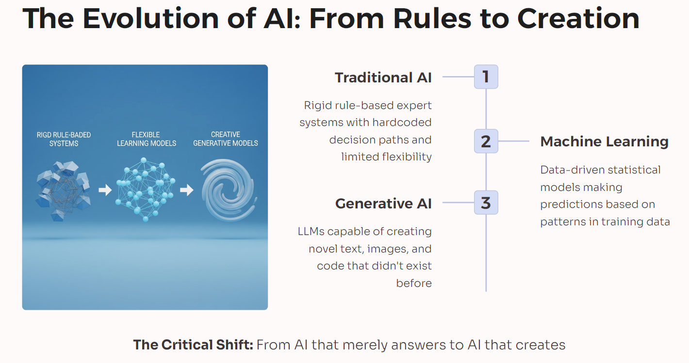
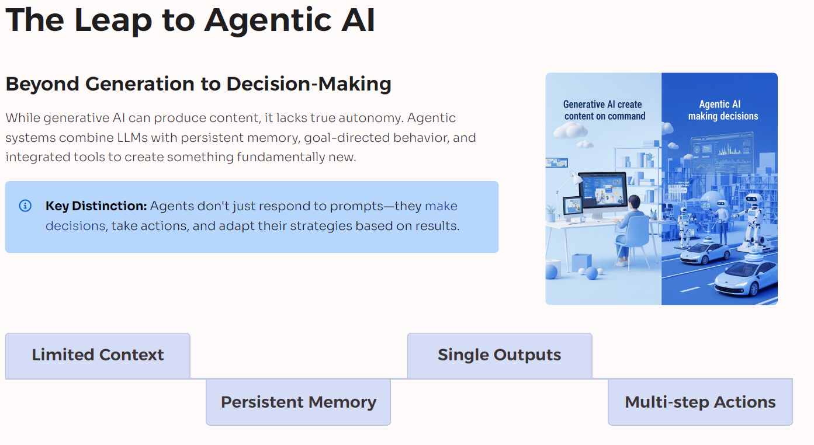
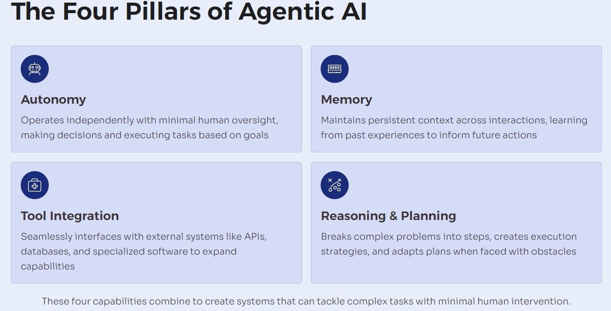
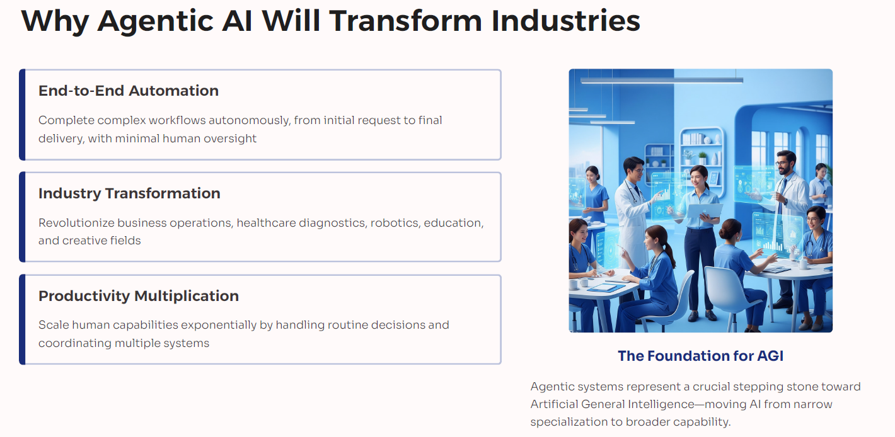
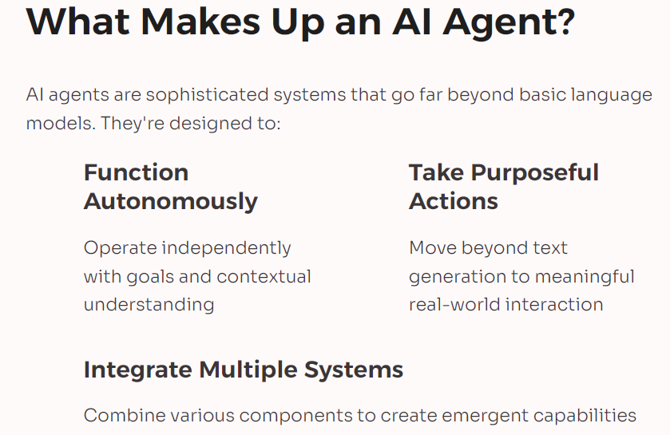
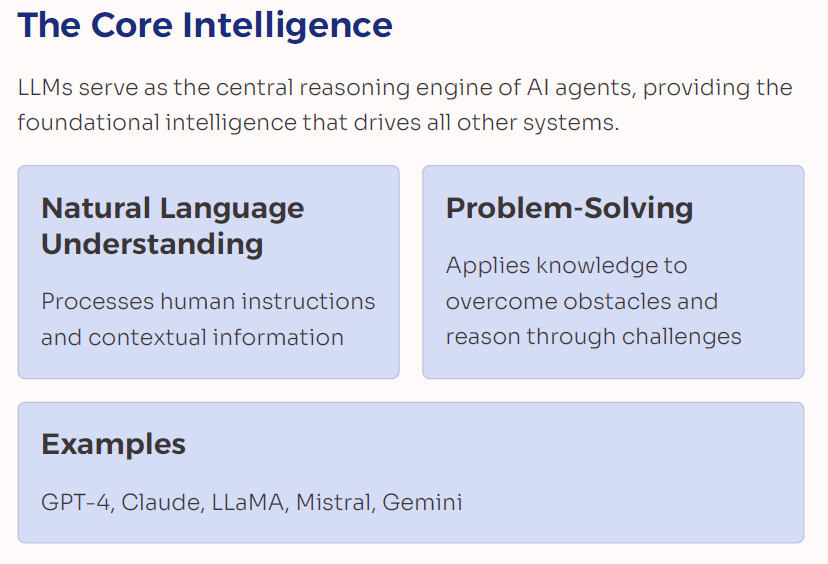
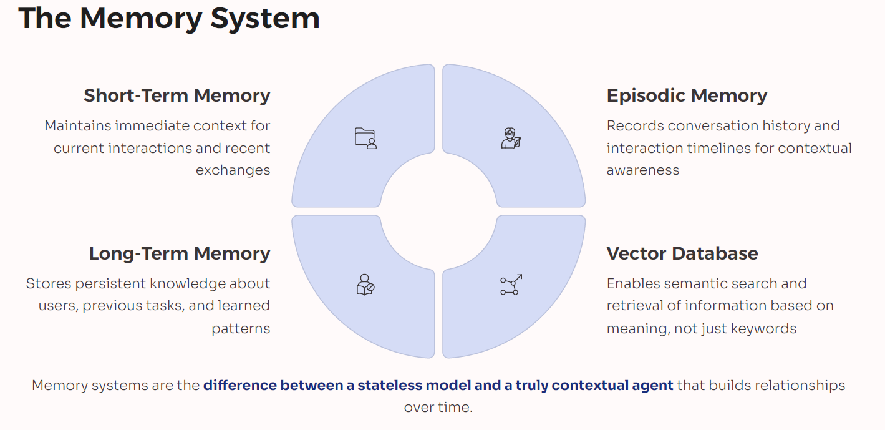
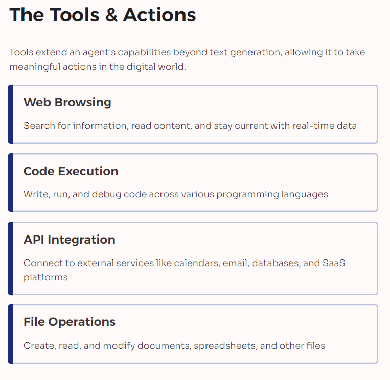
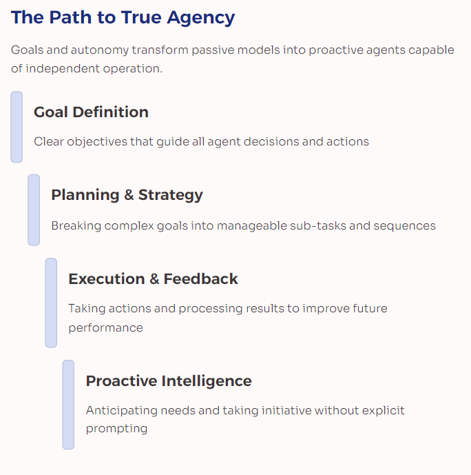

# Week 1

This opening lecture sets the tone for your year-long transformation into a builder of production-grade Agentic AI systems. 
We clarify what “agentic” means in practice—LLM-driven agents equipped with memory, tools, and planning that can reason, retrieve knowledge, and take actions to achieve business outcomes. 
You’ll get a transparent walkthrough of the program structure: weekly sprints, hands-on labs, framework comparisons (LangChain, LangGraph, LlamaIndex, CrewAI, AutoGPT), and an end-to-end capstone deployed on cloud platforms like AWS, Azure, or GCP. 
We’ll articulate the competencies you’ll develop:
- prompt engineering;
- RAG;
- vector databases (FAISS, Pinecone, Chroma);
- observability;
- guardrails;
- governance;
- AgentOps.

You’ll see how each module ladders up to build robust, safe, and cost-optimized AI agents ready for enterprise integration with APIs, databases, ERP/CRM systems, and workflow tools like n8n or Zapier. 
We’ll also set clear expectations for deliverables:
- GitHub-ready projects;
- demo videos;
- documentation suitable for portfolio and hiring panels. 

By the end, you’ll understand why demand is surging for professionals who can connect LLMs with tools, design memory and retrieval, and ensure safety and governance—and how this program gives you the repeatable patterns to ship value, not just prototypes. 
Keywords you’ll encounter and apply throughout the course include:
- Agentic AI;
- LLM agents;
- RAG;
- vector search;
- prompt engineering;
- LangChain;
- LangGraph;
- lamaIndex;
- CrewAI;
- AutoGPT;
- guardrails;
- AgentOps;
- Kubernetes;
- serverless deployment.

You’ll leave with a clear roadmap, a checklist for your environment setup, and an understanding of how we’ll measure your growth via benchmarks, UX evaluations, and ROI impact. 
This is your launchpad for a 52-week applied mastery of Agentic AI.

Keywords:
- Agentic AI;
- LLM agents;
- RAG;
- vector databases;
- prompt engineering;
- LangChain;
- LangGraph;
- LlamaIndex;
- CrewAI;
- AutoGPT;
- guardrails;
- AgentOps;
- Kubernetes;
- serverless.

## Day 1: What is Agentic AI? Evolution from AI → Generative AI → Agents

In this lecture, we trace the trajectory from rule-based AI to machine learning, onward to deep learning and Generative AI, culminating in Agentic AI. 
You’ll learn what makes an agent more than a chatbot: 
- the fusion of LLM reasoning;
- tool use;
- memory;
- planning;
- autonomous task execution.

We compare eras:
- expert systems with brittle rules;
- ML models that predict but don’t act;
- Generative AI that creates but remains passive;
- agents that can perceive context, retrieve knowledge, decide, and do. 

We’ll detail where agents shine:
- workflow automation;
- data analysis;
- research assistance;
- sales ops;
- customer support;
- DevOps;
- security

and where they must be constrained with:
- guardrails;
- policy enforcement;
- human-in-the-loop oversight. 

You’ll analyze the enabling stack:
- __foundation models__ for language and multimodality;
- __embeddings__ for semantic search;
- __vector databases__ for long-term memory;
- __frameworks__ such as LangChain, LangGraph, LlamaIndex, and CrewAI for orchestration. 

We cover real-world pitfalls:
- prompt injection;
- hallucinations;
- data leakage;
- cost blowouts

and mitigation patterns likeL
- RAG;
- retrieval filters;
- least-privilege tools;
- observability;
- rate limiting.

By the end, you’ll be able to articulate a crisp definition of Agentic AI, map its business impact, and identify the capabilities your first agent should include. 
You’ll also receive a quick rubric to decide when a simple LLM suffices and when you need a full agent with planning, tools, and memory.

Keywords:
- Agentic AI;
- Generative AI;
- LLM;
- embeddings;
- vector database;
- RAG;
- LangChain;
- LangGraph;
- LlamaIndex;
- CrewAI;
- guardrails;
- human-in-the-loop;
- prompt injection.

## Day 2: Anatomy of an AI Agent (LLM, memory, tools, goals)

Here we open up the black box and label every moving part.  
An effective AI agent starts with an LLM as the reasoning core, but its power comes from connected capabilities:
- memory (short-term context windows, long-term vector stores and episodic logs);
- tools (functions, APIs, code execution, retrieval);
- goals (structured tasks, constraints, and success metrics).

We’ll walk through a canonical architecture: user intent → planner → tool selection → execution → memory updates → reflection → next step. 
You’ll learn how embeddings make past knowledge findable and how RAG grounds responses in trusted data. 
We’ll cover prompt templates, system instructions, and state stores for reliable behavior across steps. 
You’ll also examine safety layers—from content policies to schema validation to policy-as-code—and observability:
- traces;
- logs;
- metrics;
- cost dashboards. 
By the end, you’ll be able to diagram an agent, justify each component, and reason about trade-offs like planning depth vs latency, context size vs cost, and tool breadth vs safety. 
We’ll provide a checklist to define goals, inputs, outputs, and acceptance tests, ensuring your agents deliver measurable value.

Keywords:
- AI agent architecture;
- LLM;
- memory;
- embeddings;
- RAG,;
- tools;
- goal-oriented planning;
- observability;
- guardrails;
- tracing;
- cost optimization.

