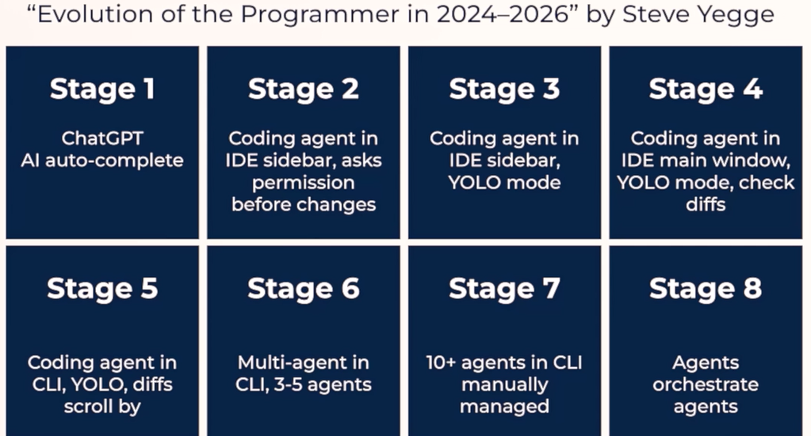

# Day 1

- How do you build a 3D shooter game using AI to write the code for you?

- What is Cursor AI and how do you set it up for your first project?

- Can you really create an FPS game with AI — even with zero coding skills?

- How does vibe coding with an AI agent work in practice?

- What does it look like to generate a 3D game from a simple text prompt?

- How do you get started with Cursor's free trial and configure it on Mac or PC?

- How can you build a 3D shooter game using AI without writing a single line of code?

- What is Cursor AI Agent and how does it generate a complete FPS game from a simple prompt?

- How do you iterate and fix issues when vibe coding a game with AI tools like Cursor and Claude?

- What are Ralph Loops in Claude Code, and how do they produce sophisticated game projects in one shot?

- How can you use AI to add features like enemy detail, a heads-up display, and difficulty scaling to your game?

- What does the workflow look like when you build a game using AI as your coding partner?

- What is agentic AI coding and how does it differ from traditional vibe coding?

- How can developers — from beginners to senior staff engineers — use AI agents to build complete software products?

- What are the key tools, concepts, and workflows behind agentic coding, including MCP, prompts, hooks, and coding agents like Claude Code and Cursor?

- How do you separate the hype from reality when it comes to AI-assisted coding?

- What are the real strengths and pitfalls of using LLMs and AI agents in your development workflow?

- How can you future-proof your career by mastering the agentic AI coding landscape?

- How do AI agents and tools like Claude Code, Cursor, Copilot, and Codex fit into a modern coding workflow?

- What's the difference between using code to build AI agents versus using AI agents to write code for you?

- How do multi-agent systems, orchestration, and autonomous agent swarms work together in real commercial projects?

- What core skills, frameworks, and prompt techniques do you need to go from beginner to expert-level agentic AI coder?

- How can you build and deploy large-scale software using AI-powered coding tools and multi-step workflows?

- What is vibe coding, and how did it evolve from a viral tweet into a full-blown movement reshaping software development?

- What's the difference between vibe coding, vibe engineering, and agentic coding — and why does it matter?

- What are coding agents like Claude Code, Cursor, and Gemini CLI, and how do developers actually use them?

- What are the three main surfaces — IDEs, plugins, and CLIs — for working with AI-assisted coding tools?

- How do you cut through the noise and focus on the AI coding tools that deliver real value?

- What was the inflection point in late 2025 that made agentic AI coding dramatically more powerful?

- What are the 8 levels of AI coding, and how do they map from basic ChatGPT prompting to full agent orchestration?

- How does an AI agent in your IDE evolve from a sidebar assistant to an autonomous coding workflow?

- What is the difference between using a coding agent in Cursor vs. Claude Code on the command line?

- How do multi-agent systems work together to build software, and what does agentic orchestration look like in practice?

- What is the sweet spot for deploying autonomous agents in enterprise software development?

- How much do AI coding tools actually cost, and can you get started for free?

- What does the agentic coding landscape look like, and where do you fit in across the 8 levels of AI adoption?

- How do AI agent workflows differ from traditional coding, and why will your results be unique every time?

- Why do autonomous agent outputs vary between models like ChatGPT and Claude — and how should you embrace that?

- What's the best way to navigate the fast-moving world of agentic AI without getting distracted by hype?

- How can you track your progress through a structured, multi-phase curriculum for becoming an expert agentic coder?

- How do you build visibility and expertise in AI coding by sharing your learning journey?