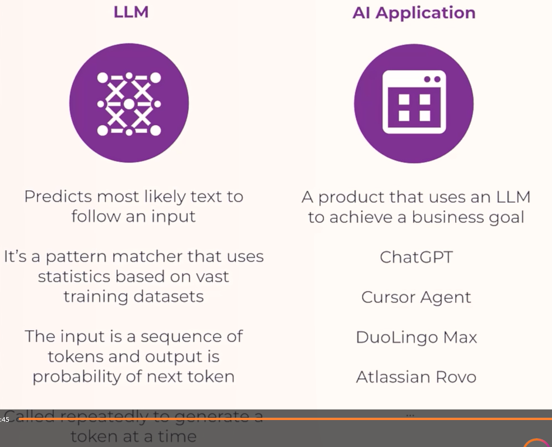
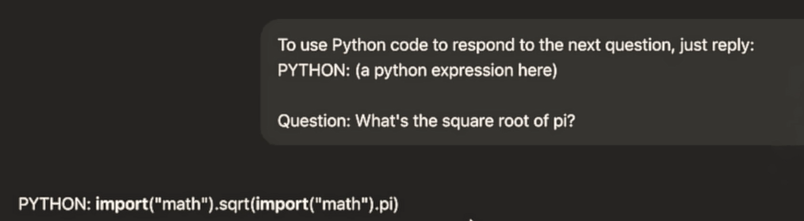
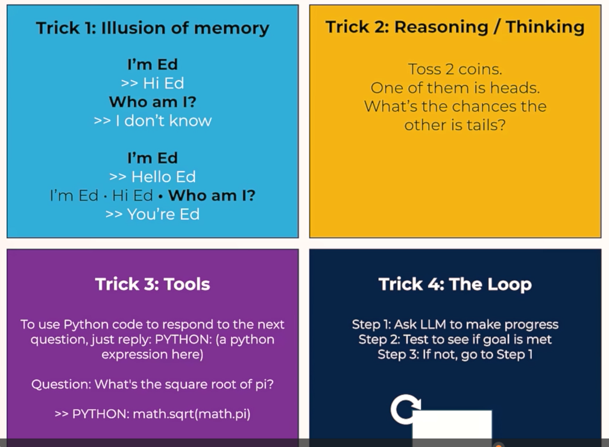
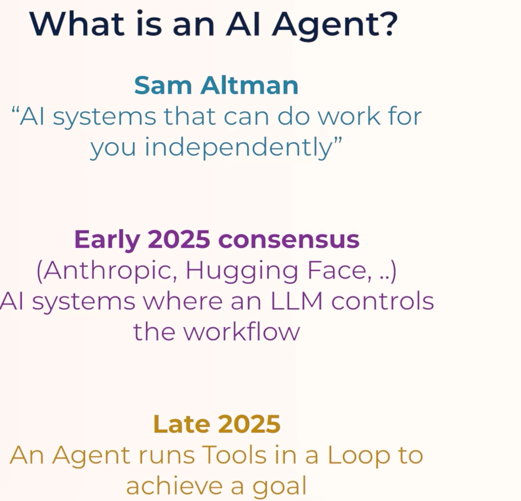
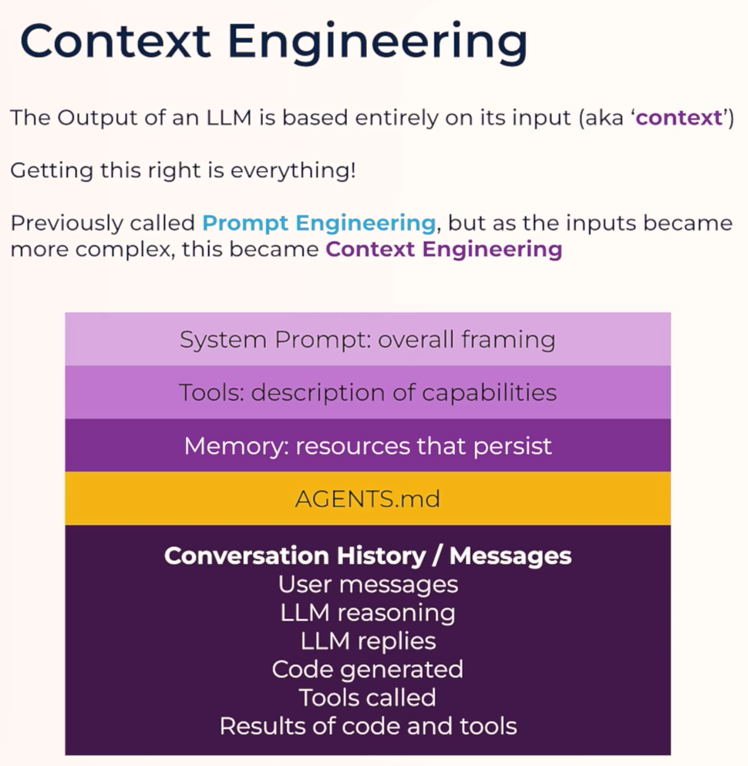
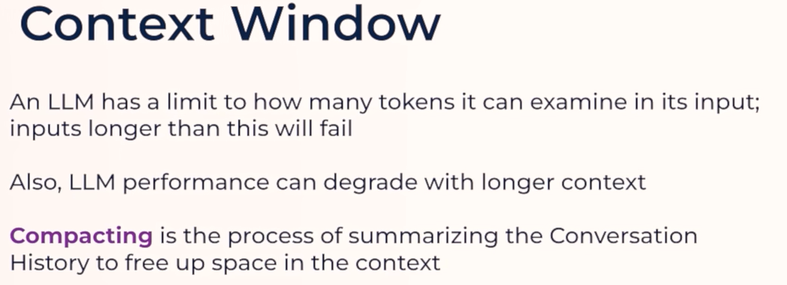

# Day 2

## How LLMs Work: Tokens, Memory, and Reasoning Explained

- What is a large language model (LLM) and how does it actually generate text?

- What are tokens and why do LLMs use them instead of words?

- How does ChatGPT remember your conversation if LLMs are stateless?

- What is LLM reasoning, and why does "thinking step by step" produce better outputs?

- What's the difference between an LLM like GPT and an AI application like ChatGPT?

- How does the token-by-token inference process work under the hood?

## Tools, Loops, and the Definition of AI Agents

- What are tools in the context of LLM agents, and how do they allow AI systems to take real-world actions?

- How does an LLM use tokens to decide when to call external tools like a calculator or Python code?

- What is a loop in agentic AI workflows, and why does calling an LLM multiple times unlock complex reasoning?

- What is the current, widely accepted definition of an AI agent?

- How do tools and loops work together to power products like Cursor Agent and Claude Code?

- How has the definition of AI agents evolved from OpenAI's early framing to the 2025 consensus?

## Context Engineering: System Prompts, Context Windows & agents.md

- What is context engineering and how does it differ from prompt engineering?

- How do system prompts, tool descriptions, memory, and conversation history form the input context for AI agents?

- What is an agents.md (or claude.md) file and why is it critical for coding agents?

- How do context windows work, and what are the token limits for GPT 5.2, Claude Sonnet 4.5, and Gemini?

- What is context compacting, and should you trust it or manually manage your context?

- Why does putting less in the context often produce better AI coding results?