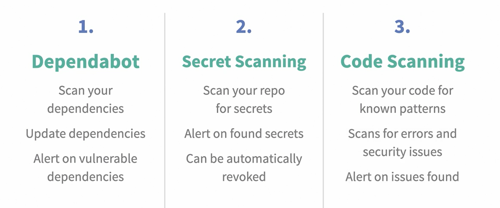
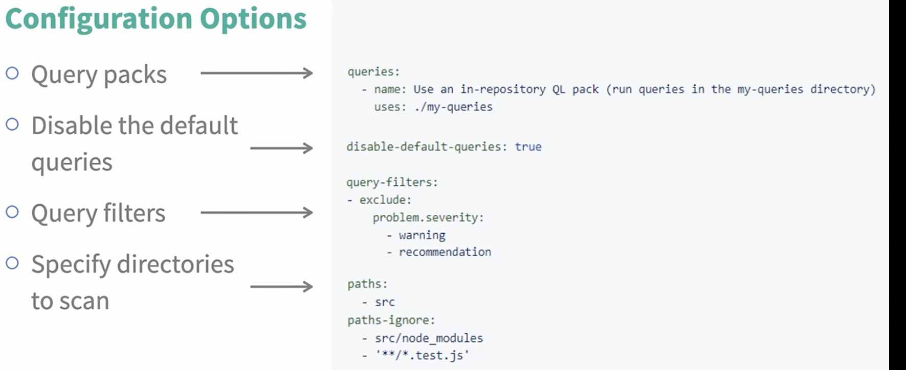

# Advanced Security



## dependabot

Dependabot is an excellent tool for open-source projects on GitHub, automating security fixes and helping you maintain up-to-date dependencies. With Dependabot, your project remains secure, and it can even automatically assign PRs with security fixes to specific team members!

### Setting Up Dependabot

Here’s a step-by-step guide to implementing some of Dependabot’s coolest features for your GitHub projects:

    Navigate to Repository Settings
    Go to the settings of your repository, and under the Code security and analysis section, enable Dependabot alerts, Dependabot security updates, and Dependabot version updates.

Navigate to your repository settings, and then to code security and analysis

### Creating dependabot.yml
Enabling version updates will allow you to edit the configuration directly in the GitHub editor or by creating a .github/dependabot.yml file in your project.

Here’s a simple setup for an Angular project using yarn or npm:

```
version: 2
updates:
  - package-ecosystem: "npm" # you can use 'npm' also for the case of yarn projects
    directory: "/" # Root directory, adjust if needed for monorepos
    schedule:
      interval: "daily" # Choose 'weekly', 'monthly', etc. as per your need
    assignees:
      - "YOURNAME1" # Replace with your GitHub username(s)
    reviewers:
      - "YOURNAME2" # Add other team members as needed
    labels:
      - "dependencies"
      - "yarn"
      - "automated"
    commit-message:
      prefix: "deps" # Customize this if needed (e.g., "chore", "build")
    open-pull-requests-limit: 10 # Limit the number of open PRs
    ignore:
      - dependency-name: "chalk" # Exclude specific dependencies if needed
```

Once this file is added to your project (preferably via PR), Dependabot will automatically open pull requests to update dependencies, with the assigned reviewers and labels you’ve configured. This setup ensures everything stays up to date and secure, even for older projects.

You will see in the future (immediately if you are using an old project) a lot of PRs opened by the bot, and with the reviewers and assignees you referred in the yml file. If you are working on an old project, pay attention to the open-pull-requests-limit flag, it may help limit the amount of PRs the bot will create. Make sure you have the labels set up in your PRs, otherwise it will show an error message.

Notice you can even make Dependabot perform actions just by writing comments in the open PRs

You can trigger Dependabot actions by commenting on this PR:

    @dependabot rebase will rebase this PR
    @dependabot recreate will recreate this PR, overwriting any edits that have been made to it
    @dependabot merge will merge this PR after your CI passes on it

… and the list goes on!

### Monitoring GitHub Actions

Dependabot doesn’t just help with dependency updates — it can also monitor and update your GitHub Actions whenever new versions are released.

Conclusion

By setting up Dependabot, you streamline project maintenance, ensuring everything stays secure, all while assigning the right people to review PRs automatically.


## CodeQL

