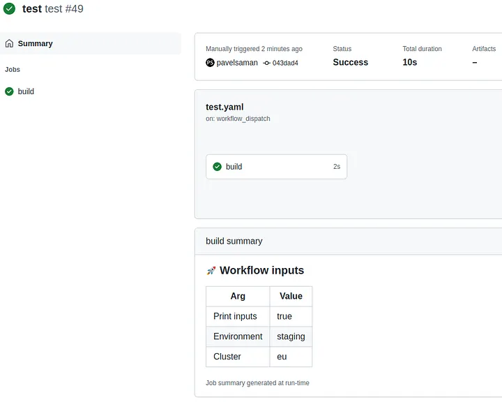

# GITHUB_STEP_SUMMARY

By writing to the __GITHUB_STEP_SUMMARY__ file, a summary of log messages can be stored in one file per job.

GitHub jobs can have all sorts of inputs, outputs, or what not that you might be interested in. But it’s not always as straighforward to get to this info as you might want to. That’s why GitHub introduced job summaries.

The GitHub page mentions a simple example how you can use job summaries using the GITHUB_STEP_SUMMARYvariable. Let’s see something a tiny bit more than that.

Let’s assume that your workflow has a number of inputs. That’s a reasonable assumption since you might build one general workflow that’s reused in a number of other workflows. You then achieve what you want by passing inputs to the reusable workflow.

Let’s use this trigger and inputs as an example:
```
on:
  workflow_call:
    inputs:
      print-inputs:
        description: print input variables
        required: false
        default: false
        type: boolean
      environment:
        description: deploy to this environment
        required: true
        type: string
      cluster:
        description: cluster to deploy to
        required: true
        type: string
```
Then when you call this workflow, you’d like to see what inputs were passed in.

Option one is to dig into the job logs. But that’s not very convenient, it can take time.
Write on Medium

Another option is a step summary. Let’s build one:
```
- if: inputs.print-inputs
  run: |
    {
      echo "### :rocket: Workflow inputs"
      echo "| Arg                 | Value |"
      echo "| ------------------- | ----- |"
      echo "| Print inputs        | ${{ inputs.print-inputs }} |"
      echo "| Environment         | ${{ inputs.environment }} |"
      echo "| Cluster             | ${{ inputs.cluster }} |"
    } >> $GITHUB_STEP_SUMMARY
```
When this step runs, it creates a Markdown that the GitHub job summary page can render:



There’s now no need to go into job logs.<br/>
The input variables are nicely visible on the summary page.

There are also all sorts of Markdown features you can use. GitHub uses their own GitHub Flavored Markdown.

A simple trick that can save you a few clicks every time you need to look up how a job ran.

Perhaps one more note about the conditional in the step. The job summaries might sometimes be a bit noisy when you use a matrix strategy for yout jobs. I don’t really think it’s a big deal because if you don’t scroll on the job summary page, you won’t even see the job summaries. But it’s still nice to give people the option of turning the job summaries off in some workflows, hence the print-inputsvariable.