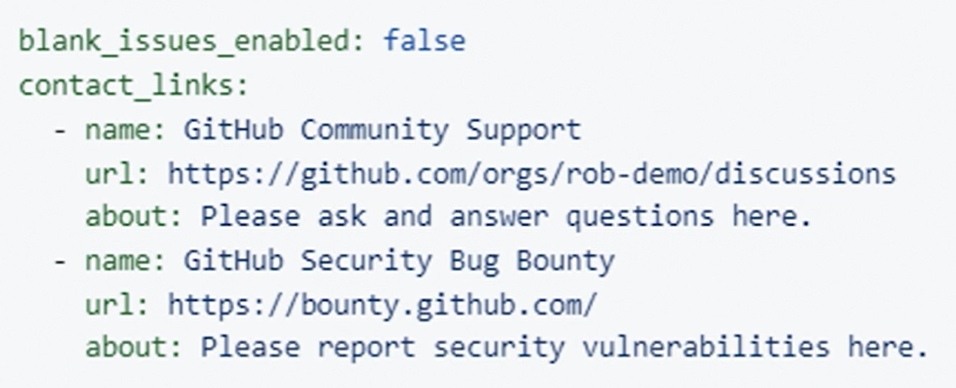

# ISSUE TEMPLATES

To create a template for issues, go to the repo settings. 
Add a template. 
There are three template options:
- bug report (bug_report.md);
- feature request (feature_request.md);
- custom issue (custom.md).

The template files are stored in __.github/ISSUE_TEMPLATE/__ folder. 
Account or organisation wide templates can be stored in the ISSUE_TEMPLATE folder of the .github repo

Behaviour can be directed by a __config.yml__ file in the same folder.

# Issue template forms

It is possible to create form like issue templates using yaml syntax.

More information can be found here: [Configuring issue templates for your repository](https://docs.github.com/en/communities/using-templates-to-encourage-useful-issues-and-pull-requests/configuring-issue-templates-for-your-repository).