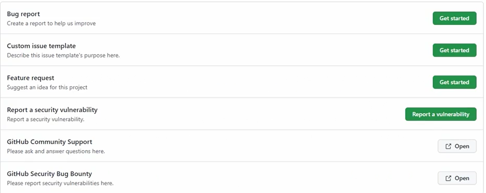

# ISSUE TEMPLATES

To create a template for issues, go to the repo settings. 
Add a template. 
There are three template options:
- bug report (bug_report.md);
- feature request (feature_request.md);
- custom issue (custom.md).

The template files are stored in __.github/ISSUE_TEMPLATE/__ folder. 
Account or organisation wide templates can be stored in the ISSUE_TEMPLATE folder of the .github repo

Behaviour can be directed by a __config.yml__ file in the same folder.

