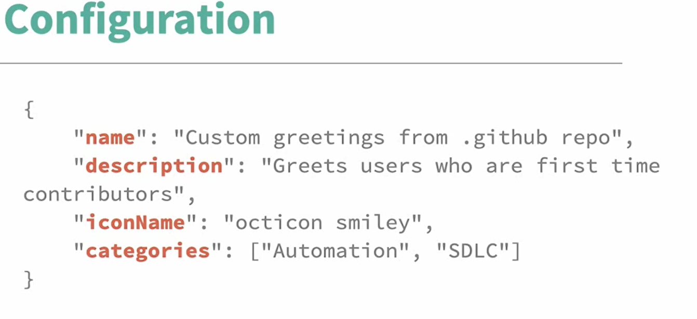

# Workflow templates

Workflow templates can be created only for organisations in the __.github__ repo. 
They need to be stored in the __workflow-templates__ folder in the default (main) branch. 
Workflow template files are in the yaml format and have a .yml file extension. 
Extra information is stored in a properties file in __json__ format in the __properties__ subfolder with the same name as the file with a __.properties.json__ extension. 
So for example:
- default-workflow.yml
- properties/default-workflow.properties.json

# Properties

## Icons
Icons that can be used are:
- the by GitHub provided default icons named octicons (github.com/primer/octicons); 
- icons with an .svg file extension, stored in the __worklow-templates__ folder.

## Categories

Categories that can be used:
- Template categories from GitHub;
- Programming languages like Julia, Go, Rust, etc;
- Tech stacks from GitHub-starter-workflows/repo-analysis-partner, such as Helm, Flask, Maven, etc.