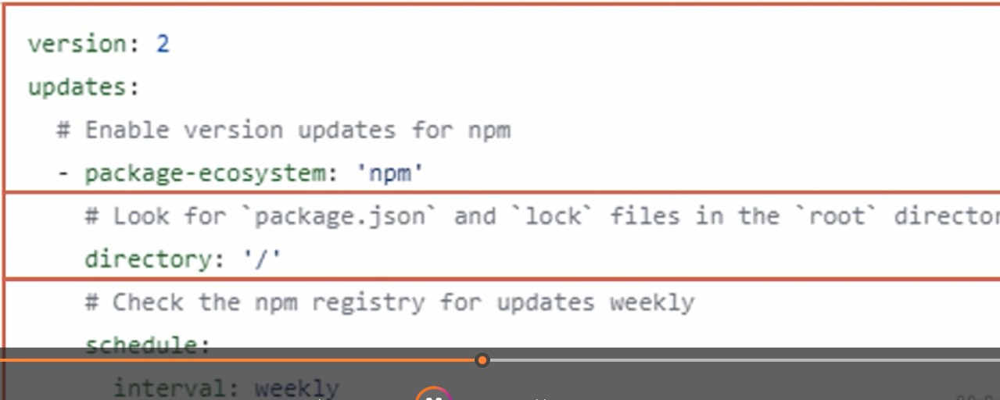

# dependabot.yml

Stored in .github folder.

## Properties

### version

Version of dependabot. Currently 2.

### package-ecosystem

E.g.: npm

### schedule

When to check

## Documentation

Find the documentation for the dependabot.yml file at the [Dependabot options reference](https://docs.github.com/en/code-security/reference/supply-chain-security/dependabot-options-reference)
