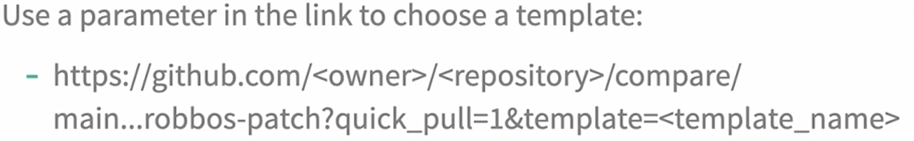
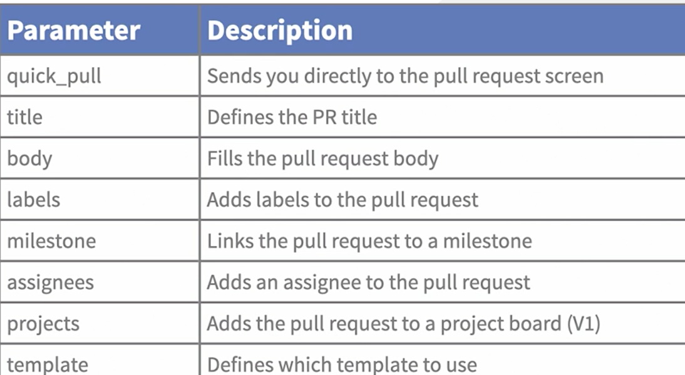

# PULL_REQUEST_TEMPLATE

This file contains a template for pull requests. 
The file format is yml.

The name can be either:
- PULL_REQUEST_TEMPLATE
- PULL_REQUEST_TEMPLATE.md
- PULL_REQUEST_TEMPLATE.txt

The file needs to be stored in any of these places:
- root folder of the repo
- /.github folder
- /docs folder

Alternatively, an account or organisation wide pull request template can be stored in a .github repo.

# Templates
It's possible to have more than one template file. 
These files need to be stored in the __PULL_REQUEST_TEMPLATE__ folder inside the .github folder.

Selecting a template can be done using this GET requestL

NB: robbos-patch is the name of a branch.

