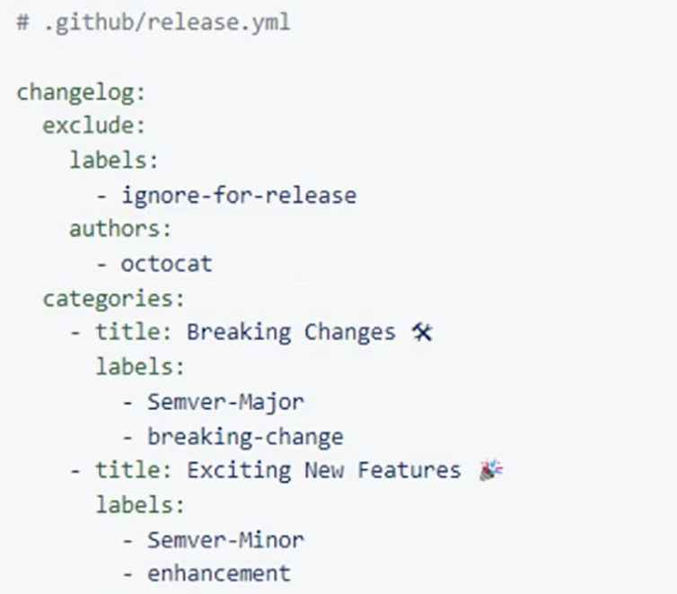

# release.yml

Release notes for a release can be automatically created by adding the texts of all pull requests since the least release.

Lay-out of the release notes is driven by __release.yml__.
File needs to be stored in __.github__ folder.

## Example

## Configuration options

| Parameter	| Description |
| --------- | ----------- |
| changelog.exclude.labels | A list of labels that exclude a pull request from appearing in release notes.
| changelog.exclude.authors | A list of user or bot login handles whose pull requests are to be excluded from release notes.
| changelog.categories[*].title | Required. The title of a category of changes in release notes.
| changelog.categories[*].labels | Required. Labels that qualify a pull request for this category. Use * as a catch-all for pull requests that didn't match any of the previous categories.
| changelog.categories[*].exclude.labels | A list of labels that exclude a pull request from appearing in this category.
| changelog.categories[*].exclude.authors | A list of user or bot login handles whose pull requests are to be excluded from this category.

See [Automatically generated release notes](https://docs.github.com/en/repositories/releasing-projects-on-github/automatically-generated-release-notes)